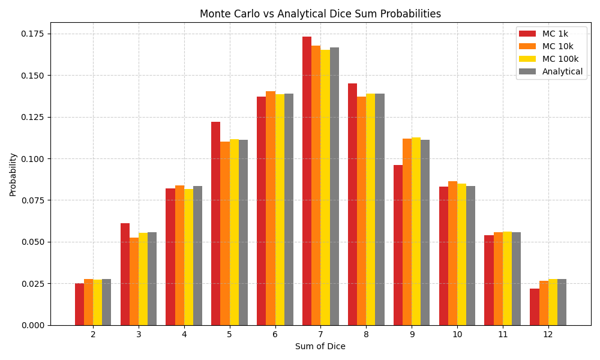

# Task 7: Monte Carlo Method – Dice Simulation

## Task Objective

Implement a program that simulates rolling two dice a large number of times, calculates the sum of values, and estimates the probability of each possible sum using the **Monte Carlo method**.

---

## Method Description

The program simulates rolling two standard dice and tracks the resulting sum of values (from 2 to 12). It calculates empirical probabilities using Monte Carlo simulations and compares them with the theoretical (analytical) probabilities.

---

## Monte Carlo Simulation: Results

Below is the combined probability table showing results for three Monte Carlo simulations (1,000; 10,000; 100,000 rolls) alongside analytical probabilities:

| Sum |   MC 1k   |  MC 10k  | MC 100k  | Analytical |
|-----|----------|----------|----------|------------|
|  2  | 0.0250   | 0.0282   | 0.0274   | 0.0278     |
|  3  | 0.0500   | 0.0575   | 0.0558   | 0.0556     |
|  4  | 0.0780   | 0.0832   | 0.0831   | 0.0833     |
|  5  | 0.1120   | 0.1094   | 0.1104   | 0.1111     |
|  6  | 0.1424   | 0.1387   | 0.1389   | 0.1389     |
|  7  | 0.1596   | 0.1701   | 0.1668   | 0.1667     |
|  8  | 0.1363   | 0.1325   | 0.1336   | 0.1389     |
|  9  | 0.1111   | 0.1116   | 0.1117   | 0.1111     |
| 10  | 0.0831   | 0.0854   | 0.0832   | 0.0833     |
| 11  | 0.0556   | 0.0573   | 0.0558   | 0.0556     |
| 12  | 0.0278   | 0.0310   | 0.0276   | 0.0278     |

> All Monte Carlo simulations tend to converge toward the analytical probabilities as the number of rolls increases. Minor deviations are expected due to randomness.

---

## Visualization

The following chart compares the empirical probabilities (Monte Carlo) with theoretical (analytical) ones:

- **Red**: Monte Carlo – 1,000 rolls  
- **Orange**: Monte Carlo – 10,000 rolls  
- **Yellow**: Monte Carlo – 100,000 rolls  
- **Gray**: Analytical probabilities  

> As visible, the difference between empirical and analytical results decreases with more rolls.

---

## Conclusiond

- The Monte Carlo method provides a practical approach for estimating probabilities.
- Even with just 10,000 simulations, the approximation is already close to theoretical values.
- The law of large numbers ensures convergence as the number of trials increases.
